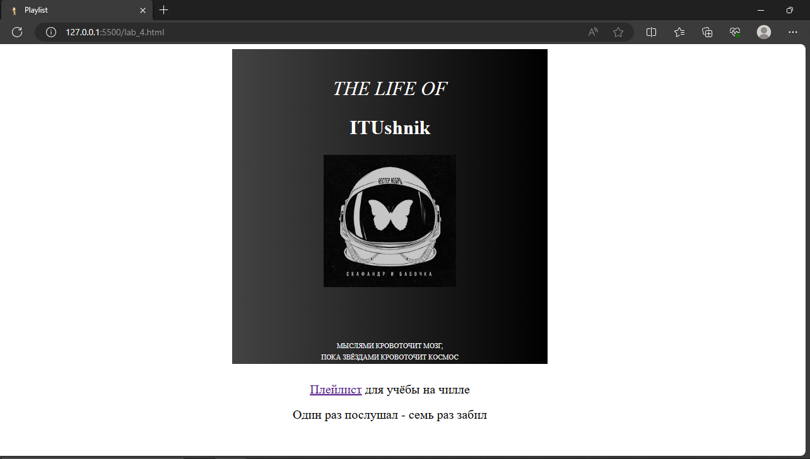

# ***Лабораторная работа 4***
**Цель работы:**
Познакомиться с вёрсткой страниц, HTML и стилями
**Код программы:**
**HTML:**
```shell
<!DOCTYPE html>
<html lang="ru">
    <head>
        <meta charset="UTF-8" />
        <meta name="viewport" content="width=device-width, initial-scale=1.0" />
        <link rel="stylesheet" href="style.css">
        <link rel="icon" href="/playlist-favicon.ico" type="image/x-icon">
    </head>
    <body>
        <div>
            <title>Playlist</title>
            <h1>The Life of</h1>
            <h2>ITUshnik</h2>
            
            <h3>Мыслями кровоточит мозг,</h3>
            <h3>пока звёздами кровоточит космос</h3>
        </div>
        <p>
            <a href="https://music.yandex.ru/users/yamusic-bestsongs/playlists/4094893" target="_blank"> Плейлист</a> для учёбы на чилле
        </p>
        <p>Один раз послушал - семь раз забил</p>
    </body>
</html>    
```

**CSS:**
```shell
img {
  width: 210px;
  margin-bottom: 80px;
}

h1, h2, h3 {
  color: white;
}

div {
  background-image: linear-gradient(to right, #434343 0%, black 100%);
  background-blend-mode: multiply;
  background-size: cover;
  width: 500px;
  height: 500px;
  margin: 0 auto 20px;
  text-align: center;
}

h1 {
  font-size: 31px;
  text-transform: uppercase;
  font-style: italic;
  font-weight: normal;
  padding-top: 45px;
  margin-top: 0;
}

h2 {
  font-size: 31px;
  margin: 35px, 35px, 35px, 35px;
}

h3 {
  font-style: '';
  font-size: 11px;
  text-transform: uppercase;
  line-height: 18px;
  font-weight: normal;
  margin: 0;
}

p {
  font-size: 20px;
  margin: 0;
  line-height: 2;
  text-align: center;
  color: black;
}
```
**Результат:**
