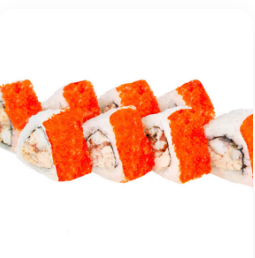
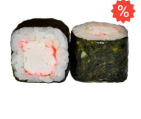
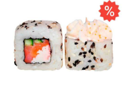
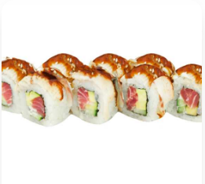
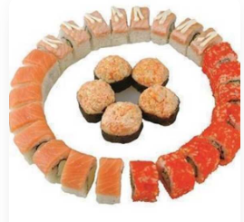
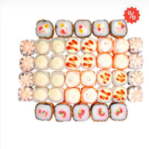
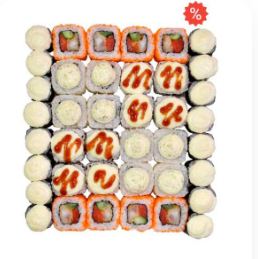
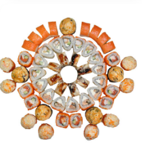
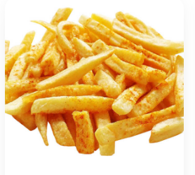
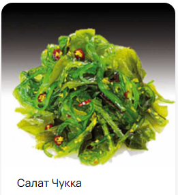

###Лабораторная работа №5
**Работа с HTML и CSS. Простые приёмы работа с DOM и BOM.**
*Глазков Максим*
*АСБ-3-036*
***Задание №1. Разработка HTML-документа***
*Код задачи:*
```
<!DOCTYPE html>
<html lang="ru">
<head>
    <meta charset="UTF-8">
    <title>Лабораторная работа №5</title>
    <link rel="stylesheet" href="styles_Desktop.css"> //или styles_Mobile_version
</head>
<body>
    <header>
        
        <nav>
            <a href="https://sushi-dona.ru/page/view/o-nas">Содержимое</a>
            <a href="https://sushi-dona.ru">Сайт</a>
        </nav>
    </header>
    <main>
        <h1>Меню</h1>
        <div class="main-catalog">
            <div class="item">
                
                <p>Ролл Оригами</p>
            </div>
            <div class="item">
                
                <p>Ролл Микава</p>
            </div>
            <div class="item">
                
                <p>Ролл мини с Крабом</p>
            </div>
            <div class="item">
                
                <p>Ролл Банзай</p>
            </div>
            <div class="item">
                
                <p>Ролл Аляска</p>
            </div>
            <div class="item">
                
                <p>Ролл Мидори</p>
        </div>
        <div class="promo-catalog">
            <h1>Популярные товары</h1>
            <div class="item">
                
                <p>Сет Азия</p>
            </div>
            <div class="item">
                
                <p>Ролл Микава</p>
            </div>
            <div class="item">
                
                <p>Сет Квартет</p>
            </div>
            <div class="item">
                
                <p>Ролл Банзай</p>
            </div>
            <div class="item">
                
                <p>Ассорти Каприз</p>
            </div>
            <div class="item">
                
                <p>Ассорти На Двоих</p>
            </div>
            <div class="item">
                
                <p>Сет Фаворит</p>
            </div>
            <div class="item">
                
                <p>Ролл Мидори</p>
            </div>
            <div class="item">
                
                <p>Сет Вегас</p>
            </div>
            <div class="item">
                
                <p>Сет Фиеста</p>
            </div>
            <div class="item">
                
                <p>Картофель фри</p>
            </div>
            <div class="item">
                
                <p>Салат Чукка</p>
	    </div>
        </div>
    </main>
    <script src="script.js"></script>
</body>
</html>
```
***Задание №2. Стили мобильной версии***
*Код:*
```
body {
    margin: 0;
    padding: 0;
    font-family: Arial, sans-serif;
}

header {
    text-align: center;
    padding: 12px;
}

p {
    font-style:italic;
    font-weight: lighter;
}

main {
    background-image: linear-gradient(120deg, #fdfbfb 0%, #ebedee 100%);
}

img {
    max-width: 100%;
    height: auto;
}

nav {
    margin-top: 12px;
}

nav a {
    text-decoration: underline;
    font-size: 25px;
}

nav a:hover {
    text-decoration: none;
}

nav a:last-child {
    margin-left: 30px;
}

.main-catalog, .promo-catalog {
    margin: 0 12px;
}

.item {
    margin-bottom: 20px;
}

.item img {
    width: 100%;
    height: auto;
}

.item p {
    font-size: 40px;
    margin-bottom: 100px;
}

.item:hover {
    opacity: 0.6;
}

.promo-catalog {
    display: flex;
    flex-wrap: wrap;
    justify-content: space-between;
    margin-left: -12px;
    margin-right: -12px;
}

main h1 {
    margin-left: 20px;
    font-style: italic;
}

.promo-catalog h1 {
    width: 100%;
    margin: 0 0 20px;
    font-size: 70px;
    margin-left: 20px;
}

.promo-catalog .item {
    width: calc(50% - 12px);
    margin-bottom: 20px;
    padding: 12px;
    box-sizing: border-box;
}
```


***Задание №3. Адаптация под десктопы***
*Код:*
```
body {
    margin: 0 40px;
    }
    h1 {
        font-style:italic;
        color:black;
    }    
    p {
        font-style:italic;
        font-weight: lighter;
    }
    header {
        text-align: left;
    }
    
    img {
        margin: 12px 0;
        max-width: 100%;
        height: auto;
    }
    
    main {
        background-image: linear-gradient(120deg, #fdfbfb 0%, #ebedee 100%);
    }

    nav {
        margin-top: 0;
        float: right;
        font-style: italic;
    }
    
    nav a:last-child {
        margin-left: 30px;
    }
    
    .main-catalog .item:hover img,
    .promo-catalog .item:hover img {
        opacity: 0.6;
        transition: opacity 0.3s ease;
    }
    
    .main-catalog {
    margin: 0;
    display: flex;
    flex-wrap: wrap;
    justify-content: space-between;
    }
    
    .main-catalog .item {
    width: calc(33.33% - 24px);
    margin-right: 24px;
    margin-bottom: 40px;
    font-size: 18px;
    }
    
    .promo-catalog {
        margin: 0;
        display: flex;
        flex-wrap: wrap;
        justify-content: space-between;
    }
    
    .promo-catalog h1 {
        width: 100%;
        margin: 0 0 20px;
    }
    
    .promo-catalog .item {
        width: calc(25% - 20px);
        margin-right: 20px;
    }
```


