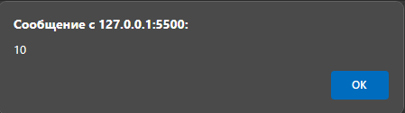
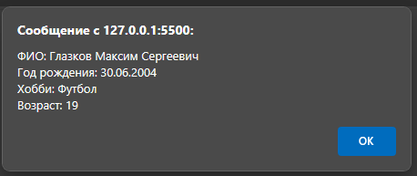
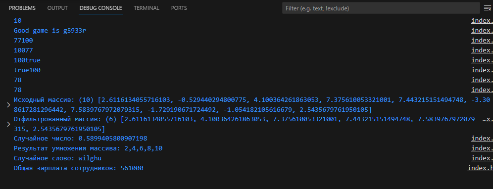

#Лабораторная работа 6
***Глазков Максим***
***АСБ-3-036***


**Код:**
```
<!DOCTYPE html>
<html lang="ru">
<head>
    <meta charset="UTF-8"/>
    <meta name="viewport" content="width=device-width, initial-scale=1.0"/>
    <title>JS</title>
</head>
<body>
<script>
    // Задание 1. Работа с переменными
    var apple = 10;
    alert(apple);
    console.log(apple);
    let abc = "abcdefghijklmnopqrstuvwxyz0123456789";     //генерация случайной строки
        let condition = "";
            condition.length = 0;
            while (condition.length < 6) {
                condition += abc[Math.floor(Math.random() * abc.length)];
            }
    console.log('Good game is ' + condition);
```
***Вопросы/Ответы:***
1. Через какой оператор Вы объявили переменую?
    - Оператор let.
2. Какие доступны операторы для объявления переменных? В чём их отличия?
    - В JavaScript есть операторы var, let, и const, с разными областями видимости и свойствами. Ключевое слово var – почти то же самое, что и let. Оно объявляет переменную, но немного по-другому, «устаревшим» способом. Переменные, объявленные с помощью const, называются «константами». Их нельзя изменить. Попытка сделать это приведёт к ошибке.
3. Что происходит при вызове alert()?
    - alert(apple) выводит значение переменной apple в диалоговом окне.
4. Как Вы думаете для чего может использоваться console.log()?
    - console.log() используется для отладки и вывода информации в консоль разработчика.

```
    // Задание 2. Магия конкатенации
    let someInt = 77;
    let strTxt = '100';
    let isTrue = true;
    console.log(someInt + strTxt);
    console.log(strTxt + someInt);
    console.log(strTxt + isTrue);
    console.log(isTrue + strTxt);
    console.log(someInt + isTrue);
    console.log(isTrue + someInt);

    // Задание 3. Работа с массивами
    let array = new Array(10);
    for (let i = 0; i < array.length; i++) {
        array[i] = Math.random() * 20 - 10;
    }
    let filteredArray = array.filter(function(number) {
        return number >= 0;
    });
    console.log("Исходный массив:", array);
    console.log("Отфильтрованный массив:", filteredArray);

    // Задание 4. Работа с функциями
    function getRandomNumber() {
        return Math.random();
    }

    function multiplyArrayByNumber(array, multiplier) {
        return array.map(function (element) {
            return element * multiplier;
        });
    }

    let generateRandomWord = function () {
        let abc = "abcdefghijklmnopqrstuvwxyz";     //генерация случайного слова
        let words = "";
        while (words.length < 6) {
            words += abc[Math.floor(Math.random() * abc.length)];
        }
        return words;
    };

    console.log("Случайное число: " + getRandomNumber());

    let testArray = [1, 2, 3, 4, 5];
    let multiplier = 2;
    console.log("Результат умножения массива: " + multiplyArrayByNumber(testArray, multiplier));
    console.log("Случайное слово: " + generateRandomWord());

    // Работа с объектами
    let person = {};
    person.surname = 'Глазков';
    person.firstName = 'Максим';
    person.patronymic = 'Сергеевич';
    person.birthday = '30.06.2004';
    person.hobby = 'Футбол';
    person.group = 'АСБ-3-036';
 person.getInfo = function () {
        let age = new Date().getFullYear() - Number(person.birthday.split('.')[2]);
        return 'ФИО: ' + person.surname + ' ' + person.firstName + ' ' + person.patronymic +
            ' \nГод рождения: ' + person.birthday +
            ' \nХобби: ' + person.hobby + ' \nВозраст: ' + age;
    };
    alert(person.getInfo());

    let salaries = {
        'Иванов': 55000,
        'Петров': 63000,
        'Соболев': 58000,
        'Пупкин': 10000,
        'Сидоров': 75000,
        'Федоров': 52000,
        'Семушин': 65000,
        'Бойко': 58000,
        'Михайлов': 72000,
        'Андреев': 53000
    };
    let totalSalary = 0;
    for (let lastName in salaries) {
        totalSalary += salaries[lastName];
    }
    console.log('Общая зарплата сотрудников: ' + totalSalary);
</script>
</body>
</html>
```

***Вывод:***


